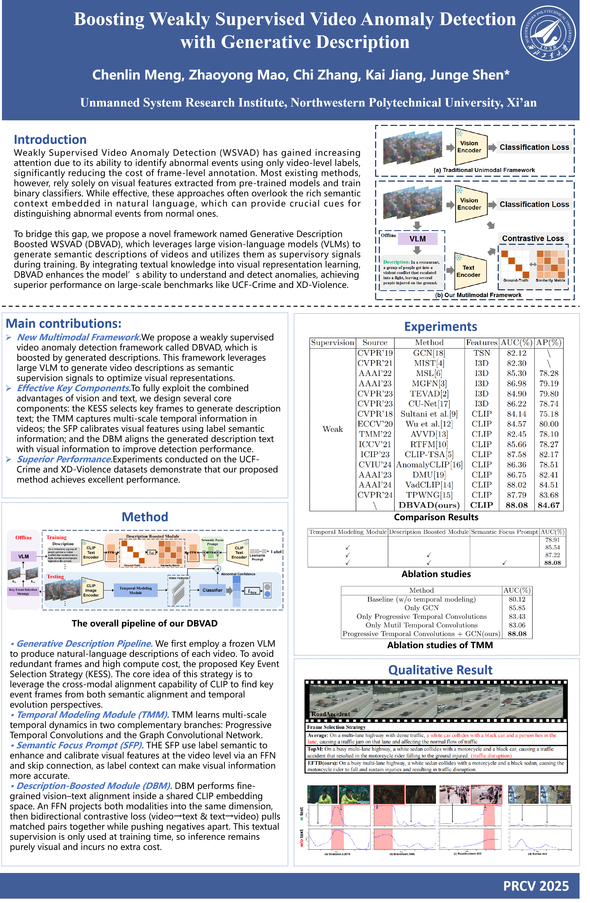

# Boosting-Weakly-Supervised-Video-Anomaly-Detection-with-Generative-Description
Our paper has been accepted by PRCV 2025! This is the official project website of our work: Boosting Weakly Supervised Video Anomaly Detection with Generative Description.

🌐 ​​Official Implementation​​ of our PRCV 2025 paper "Boosting Weakly Supervised Video Anomaly Detection with Generative Description".

This repository contains the code and models for ​​DBVAD​​, a novel framework that leverages generative descriptions from large Vision-Language Models (VLMs) as semantic supervision signals to enhance visual feature learning for Weakly Supervised Video Anomaly Detection (WSVAD).

## 📖 Overview
Weakly Supervised Video Anomaly Detection (WSVAD) aims to identify anomalous events in videos using only video-level labels, significantly reducing annotation costs. However, most existing methods rely solely on visual information, neglecting the rich semantic context available in textual descriptions.

To bridge this gap, we propose ​​DBVAD​​, a framework that integrates generative descriptions from a large VLM (Qwen2.5-VL) to boost the semantic understanding of visual features. Our key contributions include:

​​1. Key Event Selection Strategy (KESS)​​: Efficiently selects informative frames for accurate description generation.

​​2. Temporal Modeling Module (TMM)​​: Captures multi-scale temporal dependencies via progressive temporal convolutions and graph convolutional networks.

3. ​​Semantic Focus Prompt (SFP)​​: Calibrates visual features using label semantics.

4. Description Boosted Module (DBM)​​: Aligns visual features with generated descriptions via contrastive learning.

## 🚀 Key Features
The Key Features are following:
​​
1. Generative Supervision​​: Uses a large VLM to generate video descriptions as additional supervision.

2. ​​Efficient Key Frame Selection​​: KESS strategy balances semantic relevance and temporal coverage.
   
3. ​​Multi-Scale Temporal Modeling​​: Combines local and global temporal dependencies.
   
​​4. Cross-Modal Alignment​​: Enhances visual features via semantic alignment with text.

​​5. State-of-the-Art Performance​​: Achieves superior results on UCF-Crime and XD-Violence benchmarks.

 
